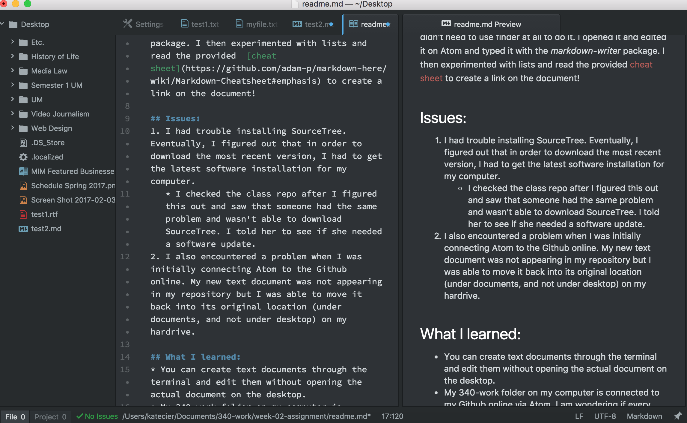

Katherine Cier 50

# Summary:
This week for class, I went through every lesson on the class Github page. I watched each video and followed along on my own computer to assure that I was doing everything correctly.  In order to download SourceTree, I had to install the most recent software update on my computer.  I created a new text in my 340-work directory and edited it through my terminal.

## Homework completion:
Before starting the homework, I installed all the recommended packages onto Atom. I used my terminal to create the new assignement in my 340-work folder and didn't need to use finder at all to do it.  I opened it and edited it on Atom and typed it with the *markdown-writer* package. I then experimented with lists and read the provided  [cheat sheet](https://github.com/adam-p/markdown-here/wiki/Markdown-Cheatsheet#emphasis) to create a link on the document!

## Issues:
1. I had trouble installing SourceTree. Eventually, I figured out that in order to download the most recent version, I had to get the latest software installation for my computer.
   * I checked the class repo after I figured this out and saw that someone had the same problem and wasn't able to download SourceTree. I told her to see if she needed a software update.
2. I also encountered a problem when I was initially connecting Atom to the Github online. My new text document was not appearing in my repository but I was able to move it back into its original location (under documents, and not under desktop) on my hardrive.

## What I learned:
* You can create text documents through the terminal and edit them without opening the actual document on the desktop.
* My 340-work folder on my computer is connected to my Github online via Atom.  I am wondering if every document I put in the folder will now sync with Github, or if I have to use the command gitin to do it with another document.
* The function of adding a code to a document still is not all that clear to me, but am able to put one in a document: `git status`

